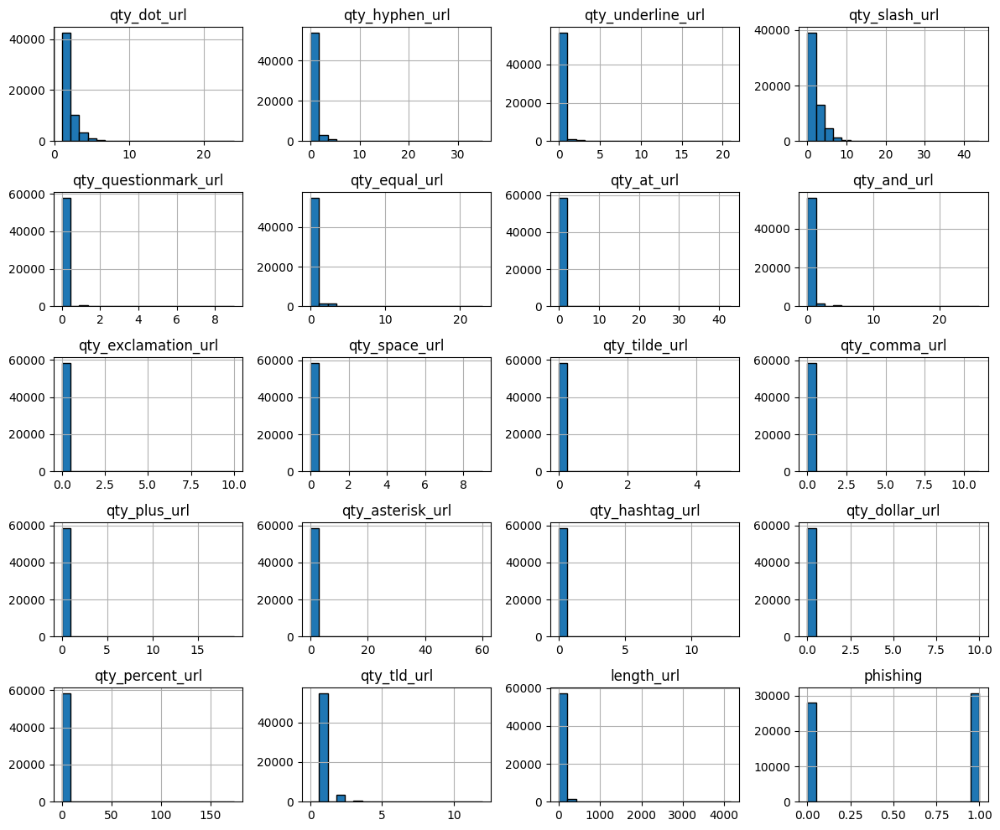
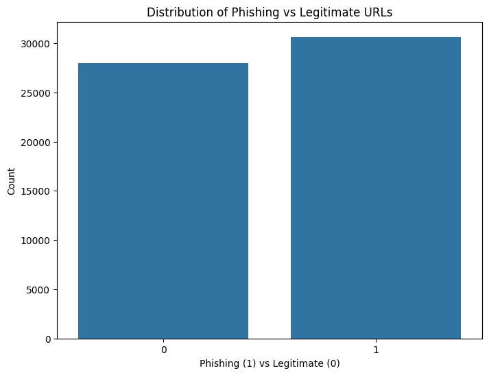
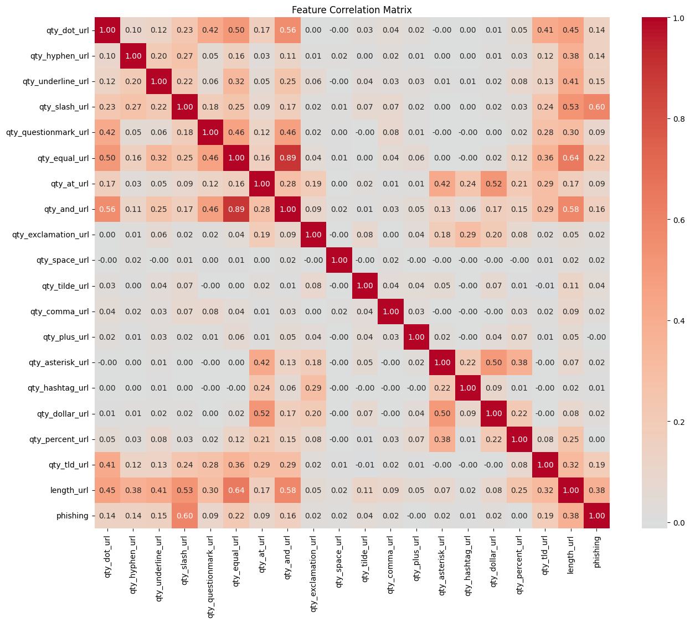
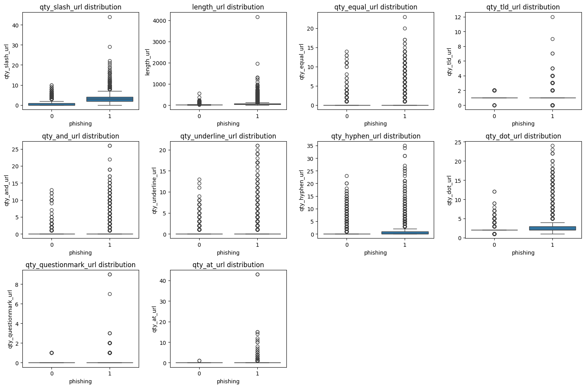
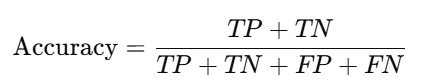
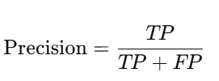
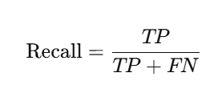
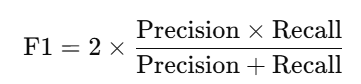
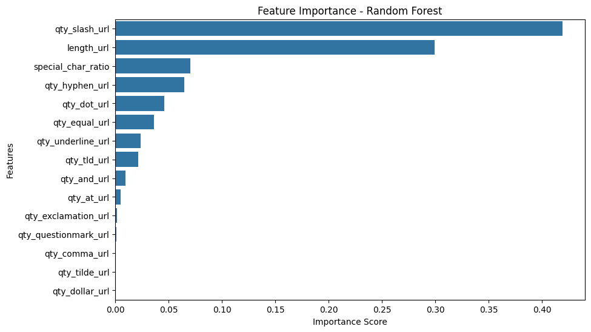

# Laporan Proyek Machine Learning - Aulia Halimatusyaddiah

## Domain Proyek

Phishing merupakan salah satu ancaman siber yang paling signifikan di era digital saat ini. Serangan ini memanfaatkan URL palsu yang dirancang menyerupai situs resmi untuk menipu pengguna agar memberikan informasi sensitif seperti kredensial login, data keuangan, atau informasi pribadi lainnya. Dengan meningkatnya aktivitas daring, terutama di sektor perbankan, e-commerce, dan layanan publik, deteksi phishing menjadi semakin krusial untuk melindungi pengguna dari potensi kerugian finansial dan pelanggaran privasi. Tradisionalnya, deteksi phishing mengandalkan metode seperti blacklist dan analisis manual. Namun, pendekatan ini memiliki keterbatasan dalam menghadapi serangan phishing yang terus berkembang dan semakin canggih. Oleh karena itu, pendekatan berbasis machine learning (ML) telah muncul sebagai solusi yang lebih adaptif dan efektif dalam mendeteksi URL phishing.

Dalam proyek ini, saya memanfaatkan dataset yang berisi fitur-fitur kuantitatif dari URL, seperti jumlah karakter khusus (misalnya titik, tanda hubung, garis bawah), panjang URL, dan jumlah top-level domain (TLD). Fitur-fitur ini digunakan untuk mengembangkan model klasifikasi yang mampu membedakan antara URL phishing dan URL yang aman dengan akurasi tinggi.

Penelitian sebelumnya telah menunjukkan efektivitas pendekatan ini. Misalnya, studi oleh Kuraku dan Kalla (2023) mengevaluasi berbagai algoritma ML, termasuk Logistic Regression, K-Nearest Neighbors, Decision Trees, Random Forests, dan Support Vector Machines, dalam mendeteksi URL phishing. Hasilnya menunjukkan bahwa model ML dapat mencapai tingkat akurasi yang tinggi dalam klasifikasi URL phishing. 

Lebih lanjut, penelitian oleh Islam et al. (2024) mengembangkan model berbasis Convolutional Neural Network (CNN) yang tidak hanya mencapai akurasi tinggi tetapi juga menyediakan analisis explainability, membantu memahami fitur-fitur yang paling berkontribusi dalam deteksi phishing. 

Dengan mengembangkan sistem deteksi phishing berbasis machine learning yang memanfaatkan fitur-fitur struktural dari URL, proyek ini bertujuan untuk menyediakan alat yang efektif dan efisien dalam melindungi pengguna dari ancaman phishing yang terus berkembang. Implementasi sistem semacam ini dapat secara signifikan meningkatkan keamanan siber, terutama dalam konteks di mana serangan phishing menjadi semakin kompleks dan sulit dideteksi dengan metode tradisional.

## Business Understanding

### Problem Statements
1. Bagaimana cara mengembangkan sistem otomatis untuk mendeteksi URL phishing hanya dengan menganalisis elemen-elemen struktural dalam URL?
2. Apa pengaruh jumlah karakter khusus terhadap probabilitas sebuah URL diklasifikasikan sebagai phishing?
3. Bagaimana cara membandingkan performa berbagai algoritma klasifikasi dalam mendeteksi URL phishing berdasarkan fitur dataset?
4. Fitur URL mana yang memiliki kontribusi paling signifikan dalam membedakan URL phishing dari yang aman?
5. Bagaimana penerapan machine learning dapat membantu mengurangi ketergantungan terhadap sistem blacklist/manual yang tidak efektif dalam menghadapi serangan phishing baru (zero-day phishing)?

### Goals
1. Mengembangkan sistem deteksi otomatis berbasis machine learning yang mampu mengklasifikasikan URL sebagai phishing atau aman hanya berdasarkan elemen-elemen struktural URL (seperti jumlah simbol, panjang URL, atau pola karakter), tanpa membutuhkan metadata atau isi halaman.
2. Menganalisis pengaruh jumlah karakter khusus dalam URL terhadap probabilitas klasifikasinya sebagai URL phishing, guna mengidentifikasi pola karakteristik umum dari URL berbahaya.
3. Mengevaluasi dan membandingkan performa berbagai algoritma klasifikasi machine learning dalam mendeteksi URL phishing, dengan menggunakan metrik evaluasi seperti akurasi, precision, recall, dan F1-score.
4. Melakukan analisis fitur (feature importance) untuk mengidentifikasi atribut-atribut URL yang paling berkontribusi dalam menentukan apakah sebuah URL termasuk phishing atau tidak, guna mendukung pengembangan model yang lebih ringan dan efisien.
5. Membuktikan bahwa penerapan machine learning dapat mengurangi ketergantungan terhadap metode deteksi phishing berbasis blacklist/manual, khususnya untuk mengidentifikasi serangan phishing baru (zero-day phishing) yang belum tercatat dalam database tradisional.

## Data Understanding
Dataset yang digunakan dalam proyek ini adalah dataset Phishing URL Detection yang tersedia secara publik di Kaggle (https://www.kaggle.com/datasets/ravirajkukade/phishingdomaindetection). Dataset ini dirancang untuk membangun dan melatih model machine learning yang mampu mengidentifikasi apakah suatu URL termasuk phishing atau bukan, hanya berdasarkan elemen-elemen struktural dari URL itu sendiri.

Data ini tidak memerlukan scraping tambahan karena seluruh fitur sudah diekstrak dan disiapkan untuk digunakan dalam pelatihan model. Seluruh atribut bersifat numerik atau biner, sehingga memungkinkan penerapan langsung berbagai algoritma klasifikasi seperti Logistic Regression, Random Forest, atau SVM.

Dataset ini sangat relevan dalam studi deteksi phishing karena tidak bergantung pada isi konten halaman, melainkan fokus pada pola URL itu sendiri, yang membuat model lebih ringan dan lebih cepat untuk implementasi real-time.

**Jumlah data:** 58645 data  
**Nilai Null:** Tidak ada  
**Duplikat:** Diperlukan karena variasi data numerik

### Variabel-variabel pada phishing URL dataset adalah sebagai berikut:
- qty_dot_url : variabel jumlah dari tanda titik (.) pada link URL.
- qty_hyphen_url : variabel jumlah dari tanda penghubung garis (-) pada link URL.
- qty_underline_url : variabel jumlah dari tanda garis bawah (_) pada link URL.
- qty_slash_url : variabel jumlah dari tanda garis miring (/) pada link URL.
- qty_questionmark_url : variabel jumlah dari tanda tanya (?) pada link URL.
- qty_equal_url : variabel jumlah dari tanda sama dengan (=) pada link URL.
- qty_at_url : variabel jumlah dari tanda penyebut (@) pada link URL.
- qty_and_url : variabel jumlah dari tanda dan (&) pada link URL.
- qty_exclamation_url : variabel jumlah dari tanda seru (!) pada link URL.
- qty_space_url : variabel jumlah dari bagian kosong (space) pada link URL.
- qty_comma_url : variabel jumlah dari tanda koma (,) pada link URL.
- qty_tilde_url : variabel jumlah dari tanda tilde (~) pada link URL.
- qty_plus_url : variabel jumlah dari tanda tambah (+) pada link URL.
- qty_asterisk_url : variabel jumlah dari tanda bintang (*) pada link URL.
- qty_hashtag_url : variabel jumlah dari tanda pagar (#) pada link URL.
- qty_dollar_url : variabel jumlah dari tanda mata uang dolar ($) pada link URL.
- qty_percent_url : variabel jumlah dari tanda persen (%) pada link URL.
- qty_tld_url : variabel jumlah dari Top level domain character pada link URL.
- length_url : variabel yang berisi jumlah semua karakter dalam URL.
- phising : varibel yang berisi informasi status URL dengan nilai 1 untuk URL phishing dan 0 untuk URL aman.

## EDA (Exploratory Data Analysis)
- Memeriksa Distribusi Fitur Numerik

Hampir semua fitur memiliki distribusi yang sangat miring ke kanan (right-skewed), artinya mayoritas nilainya rendah (dekat 0), dengan sebagian kecil yang bernilai tinggi.

- Memeriksa Distribusi Label  

Jumlah sampel dari kedua kelas relatif seimbang, dengan URL phishing sedikit lebih banyak dari legitimate. Keseimbangan ini penting dalam pemodelan klasifikasi karena membantu mencegah bias model terhadap salah satu kelas, sehingga model dapat belajar membedakan phishing dan legitimate URL secara lebih adil dan efektif.

- Memeriksa Korelasi Antar Fitur dengan Label

Korelasi ditampilkan dalam skala -1 hingga 1, dengan warna merah tua menunjukkan korelasi kuat positif. Secara umum, beberapa fitur saling berkorelasi tinggi, seperti qty_equal_url dengan qty_questionmark_url (0.89) dan qty_and_url (0.89), serta length_url yang cukup berkorelasi dengan banyak fitur (misalnya dengan qty_slash_url, qty_equal_url, dll.). Terhadap label phishing, fitur yang menunjukkan korelasi paling tinggi adalah qty_slash_url (0.60) dan length_url (0.38), menandakan bahwa URL phishing cenderung lebih panjang dan memiliki lebih banyak tanda garis miring.

- Distribusi Fitur Penting Terhadap Label

Boxplot distribusi menampilkan beberapa fitur URL berdasarkan label phishing, di mana 0 mewakili URL legit dan 1 untuk URL phishing. Secara umum, sebagian besar fitur seperti qty_slash_url, length_url, qty_equal_url, qty_dot_url, dan qty_hyphen_url cenderung memiliki nilai median dan sebaran lebih tinggi pada URL phishing dibandingkan URL legit. Hal ini mengindikasikan bahwa URL phishing sering kali memiliki struktur yang lebih kompleks dan mencurigakan, seperti lebih banyak simbol khusus (/, -, =, ., dll.) dan panjang URL yang lebih tinggi, yang dapat dimanfaatkan sebagai indikator penting dalam klasifikasi phishing.

## Data Preprocessing: 
- Feature Engineering Consideration  
Menghitung rasio total karakter khusus dalam URL terhadap panjang URL (length_url). Karakter khusus yang dimaksud mencakup berbagai simbol seperti titik (.), garis (-), garis bawah (_), garis miring (/), tanda tanya (?), tanda sama dengan (=), dan simbol lainnya yang umum digunakan dalam URL mencurigakan. Rasio ini memberikan gambaran seberapa padat simbol-simbol mencurigakan muncul dalam sebuah URL. Setelah fitur dihitung, nilai korelasi antara special_char_ratio dan label target (phishing) ditampilkan untuk mengukur sejauh mana fitur ini berhubungan dengan kemungkinan URL tersebut adalah phishing. 
- Feature Selection  
Memilih fitur yang relevan untuk proses training
- Splitting Data  
Membagi data menjadi data latih dan data tes dengan rasio 8:2.
- Handling Imbalance Class  
Menangani label yang tidak seimbang menggunakan teknik SMOTE
- Feature Scaling  
Mereduksi dimensi data agar berada di antara sekala 0 - 1.

## Modeling
### a. Logistic Regression
Logistic Regression memodelkan hubungan antara variabel input dan target dengan menggunakan fungsi logistik (sigmoid). Model ini menghasilkan probabilitas suatu data termasuk ke dalam kelas tertentu. Logistic Regression bekerja baik ketika relasi antara fitur dan label bersifat linear.  
**Parameter:**
* max_iter=1000: Untuk memastikan konvergensi.
* random_state=42: Untuk reprodusibilitas.
 
**Kelebihan:**
 Sederhana dan cepat untuk dilatih.
 Mudah diinterpretasikan.
 
**Kekurangan:**
* Linearitas antara fitur dan label dibutuhkan.
* Kurang optimal untuk data kompleks.

### b. Support Vector Machine (SVM)
SVM bekerja dengan mencari hyperplane terbaik yang memisahkan dua kelas data. Untuk kasus data tidak linear, kernel trick digunakan untuk memproyeksikan data ke ruang berdimensi lebih tinggi sehingga menjadi linear-separable.  
**Parameter:**
* probability=True: Agar bisa mengeluarkan probabilitas untuk ROC dan AUC.
* random_state=42: Konsistensi hasil.
 
**Kelebihan:**
* Cocok untuk data berdimensi tinggi.
* Kuat terhadap overfitting jika di-tune dengan benar.
 
**Kekurangan:**
* Waktu komputasi tinggi, terutama untuk dataset besar.
* Parameter tuning (kernel, C, gamma) penting namun kompleks.

### c. Random Forest Classifier + GridSearchCV
Random Forest adalah algoritma ensemble yang terdiri dari banyak pohon keputusan. Masing-masing pohon dilatih menggunakan subset data dan fitur (bagging). Hasil akhir diperoleh dari voting mayoritas.  
**Parameter yang digunakan:**
Tuning dilakukan menggunakan GridSearchCV dengan cv=5. Hasil parameter terbaik yang diperoleh adalah:
* bootstrap: False
* n_estimators = 100
* max_features: sqrt
* max_depth (maksimal kedalaman pohon) = 20
* min_samples_split = 5,
* min_samples_leaf = 2

**Kelebihan:**
* Tangguh terhadap overfitting.
* Bisa menangani fitur non-linear dan penting dalam ranking fitur.

**Kekurangan:**
* Lebih lambat dibanding Logistic Regression.
* Model akhir bisa sulit diinterpretasi.

## Evaluation
### Metrik Evaluasi yang Digunakan
Dalam proyek ini, digunakan beberapa metrik evaluasi penting untuk mengukur performa model klasifikasi phishing URL, yaitu:

#### 1. Accuracy (Akurasi)
- Definisi: Proporsi prediksi yang benar dari seluruh prediksi.
- Formula:  
  
- ​Kelebihan: Mudah dipahami, namun tidak cocok jika data tidak seimbang.

#### 2. Precision
- Definisi: Proporsi prediksi positif yang benar-benar positif.
- Formula:  
- 
- Kegunaan: Menjawab pertanyaan: "Dari semua yang diprediksi sebagai phishing, berapa yang benar-benar phishing?"

#### 3. Recall (Sensitivity / True Positive Rate)
- Definisi: Proporsi data positif yang berhasil dikenali.
- Formula:  
  
- Kegunaan: Menjawab pertanyaan: "Dari semua phishing yang ada, berapa banyak yang berhasil dideteksi?"

#### 4. F1-Score
- Definisi: Harmonik rata-rata dari precision dan recall. Digunakan ketika penting untuk menyeimbangkan keduanya.
- Formula:  
   
- Kegunaan: Sangat berguna pada data yang tidak seimbang, seperti kasus phishing detection.

### Hasil Evaluasi Proyek
Model dievaluasi menggunakan data uji setelah proses pelatihan dan tuning. Evaluasi dilakukan berdasarkan metrik utama yaitu accuracy, precision, recall, dan F1-score. Berikut ringkasan performa dari masing-masing model:

#### 1. Logistic Regression (weighted avg)
- Mencapai akurasi sebesar 0,81.
- Precision sebesar 0,82 menunjukkan proporsi prediksi phishing yang benar-benar phishing.
- Recall mencapai 0,81 menandakan bahwa model mampu mendeteksi sebagian besar URL phishing.
- F1-score berada di angka 0,81 mencerminkan keseimbangan antara precision dan recall.
  
#### 2. SVM (Support Vector Machine - weighted avg)
- Menunjukkan akurasi sebesar 0,85
- Precision sebesar 0,85 sedikit lebih tinggi dari Logistic Regression.
- Recall mencapai 0,85 menunjukkan kemampuan deteksi phishing yang baik.
- F1-score sebesar 0,85 sedikit lebih unggul dibanding Logistic Regression.

#### 3. Random Forest (Best Model - weighted avg)
- Memberikan akurasi tertinggi sebesar 0,86
- Precision sebesar 0,86 menunjukkan akurasi tinggi dalam mendeteksi phishing dengan minim false positive.
- Recall sebesar 0,86 menunjukkan model sangat baik dalam menemukan URL phishing.
- F1-score tertinggi sebesar 0,86 menjadikannya model dengan performa paling seimbang dan unggul di antara ketiga algoritma.
  
### Fitur Penting yang Relevan

Fitur yang paling berkontribusi terhadap prediksi adalah qty_slash_url, dengan skor lebih dari 0.40, menunjukkan bahwa jumlah garis miring (/) dalam URL merupakan indikator paling kuat untuk mendeteksi phishing. Diikuti oleh length_url, yang menunjukkan bahwa URL phishing cenderung lebih panjang dari URL aman. Fitur lain seperti special_char_ratio, qty_hyphen_url, dan qty_dot_url juga memberikan kontribusi signifikan, yang secara umum mendukung temuan bahwa URL phishing sering kali memiliki struktur yang kompleks dan banyak menggunakan karakter khusus. Sebaliknya, fitur seperti qty_dollar_url, qty_tilde_url, dan qty_comma_url hampir tidak memberikan kontribusi, menunjukkan bahwa simbol-simbol tersebut jarang digunakan dalam URL phishing atau tidak cukup membedakan.

### Hasil Inference:
 
Phishing URL Detection Results:  
 
<b>URL:</b> www.google.com  
<b>Prediction:</b> Legitimate  
<b>Phishing Probability:</b> 34.81%  
<b>Legitimate Probability:</b> 65.19%  
--------------------------------------------------  
 
<b>URL:</b> http://paypal-verify-account.com/login.php  
<b>Prediction:</b> Phishing  
<b>Phishing Probability:</b> 96.31%  
<b>Legitimate Probability:</b> 3.69%  
--------------------------------------------------  
 
<b>URL:</b> hhttps://link.dana.id/kaget?c=snqw25mpx&r=b7NAEX  
<b>Prediction:</b> Phishing  
<b>Phishing Probability:</b> 75.09%  
<b>Legitimate Probability:</b> 24.91%  
--------------------------------------------------  
 
<b>URL:</b> https://linkdanaa-kaget.webssit3.my.id/int.htmlhttps://1xlite-9231274.top/id/registration?type=email&bonus=SPORT  
<b>Prediction:</b> Phishing  
<b>Phishing Probability:</b> 99.48%  
<b>Legitimate Probability:</b> 0.52%  
--------------------------------------------------  

### Daftar Pustaka 
Kuraku, S. and Kalla, D., 2023. Phishing website URL’s detection using NLP and machine learning techniques. Journal on Artificial Intelligence - Tech Science. Available at: SSRN [https://ssrn.com/abstract=4666805]

Islam, M.R., Jahan, S., Hossain, S.M.M. and Rahman, M.A., 2024. PhishGuard: A convolutional neural network based model for detecting phishing URLs with explainability analysis. arXiv preprint arXiv:2404.17960. Available at: https://arxiv.org/abs/2404.17960

Guo, W., Zhang, L., Yang, Y. and Liu, H., 2025. Efficient phishing URL detection using graph-based machine learning and loopy belief propagation. arXiv preprint arXiv:2501.06912. Available at: https://arxiv.org/abs/2501.06912
